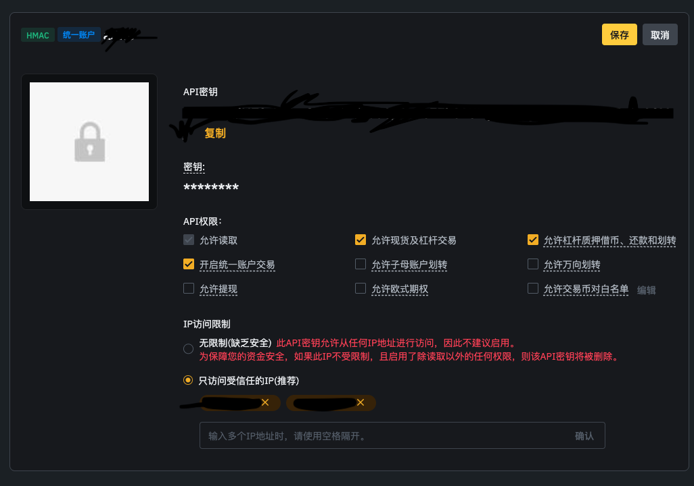
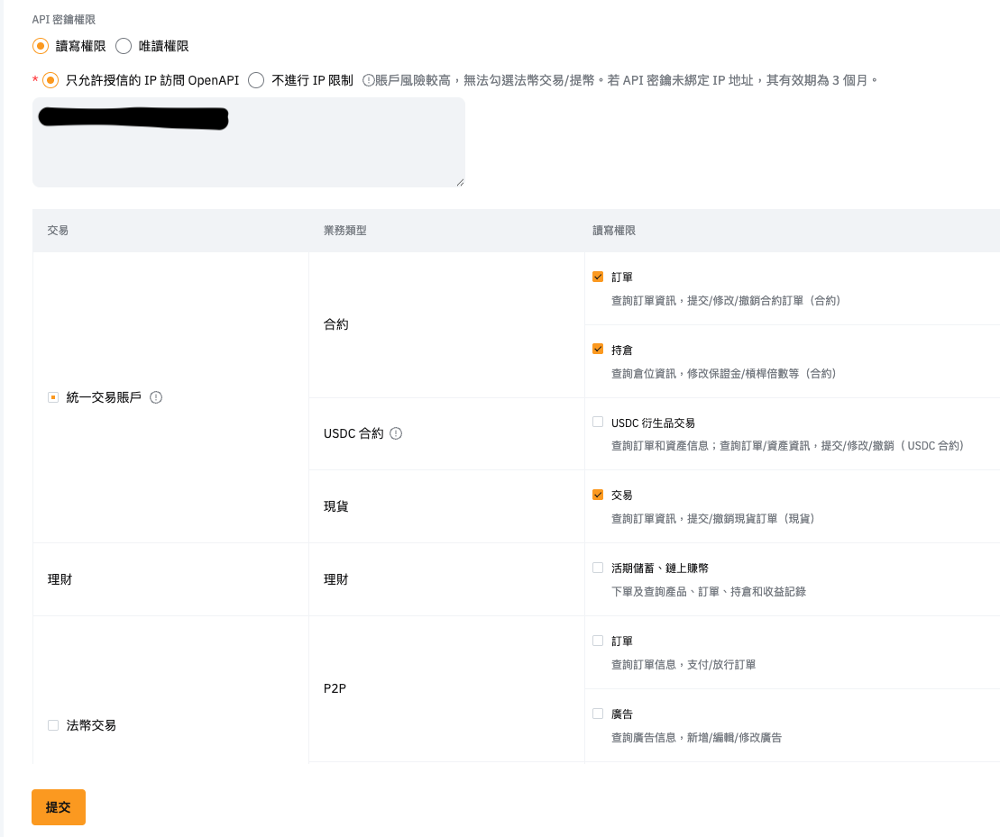
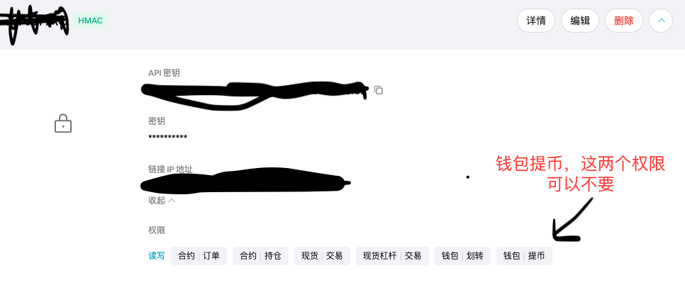
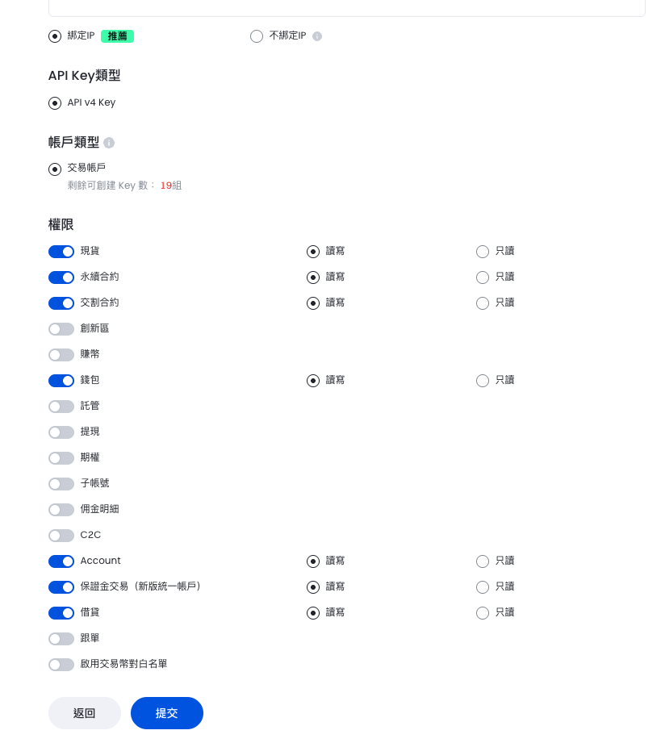
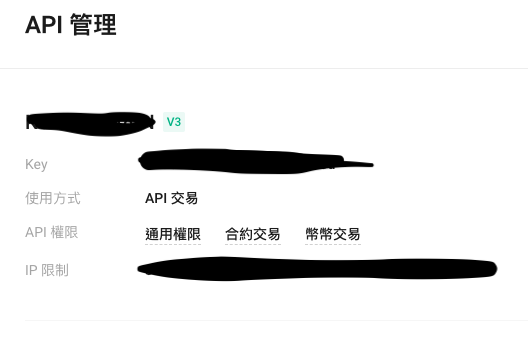

# astro - 安装教程

### 1. 云服务器要求
切记不可以使用中国境内服务器，推荐阿里云或AWS日本地区 \
**境外网络完全可以本地部署，交易所KEY需要绑定IP，请注意IP变化** \

操作系统: ```Ubuntu 24.x版本``` \
系统架构：```x86-64``` \
内存：```最少1GB``` \
运行```hostnamectl```命令,返回以下结果

```
Static hostname: *
       Icon name: computer-vm
         Chassis: vm 🖴
      Machine ID: *
         Boot ID: *
  Virtualization: kvm
Operating System: Ubuntu 24.04.1 LTS        // * 这项是必须的, 24.x版本
          Kernel: Linux 6.8.0-40-generic
    Architecture: x86-64                    // * 这项是必须的
 Hardware Vendor: Alibaba Cloud
  Hardware Model: Alibaba Cloud ECS
Firmware Version: 0.0.0
   Firmware Date: Fri 2015-02-06
    Firmware Age: 10y 2month 1w 5d 
```

### 2. 执行一键安装脚本 (需输入公网IP地址)
```
curl -L https://raw.githubusercontent.com/astro-btc/astro/refs/heads/main/ubuntu-x64-install.sh | sudo bash -
```
### 3. astro-server/.env 文件字段说明

| **配置项**               | **说明**                                                        |
|--------------------------|-----------------------------------------------------------------|
| `PORT`                   | 端口号，需要防火墙放行此端口                                      |
| `ALLOWED_DOMAIN`         | 云服务公网IP地址，也可以填域名（填写域名需替换证书）                                      |
| `ADMIN_PREFIX`           | 管理后台访问的 URL 前缀，可自行更改                             |
| `ADMIN_SECURITY_CODE`    | 登录密码                                                        |
| `ADMIN_2FA_SECRET`       | 二次认证密钥，请导入 Google Authentication 使用，可自行修改     |


此配置文件修改过后，请执行 ```sudo pm2 restart astro-server``` 重启生效 

### 4. 如何配置交易所API？
‼️ 请务必每一个api都添加IP地址白名单 ‼️  \
‼️ 请务必 **不要** 开通[提现]权限 ‼️ 

#### a. Binance
合约账户类型必须是 **统一账户**, 权限相关参考下图：\


#### b. Bybit
权限相关参考下图：\


#### c. Bitget
请使用联合保证金模式，权限相关参考下图：\


#### d. OKX
请使用跨币种保证金模式，权限相关参考下图：\


#### e. Gate
请使用统一账户+跨币种保证金模式，权限相关参考下图：\


#### f. Kucoin
权限相关参考下图：\


#### g. Aster
官网直接配置即可
