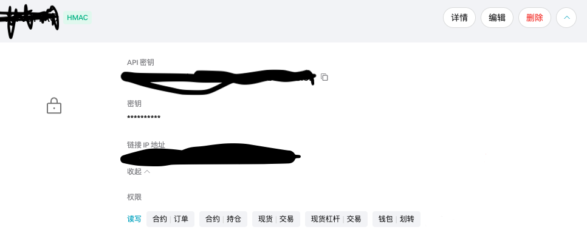

# astro - 安装教程

### 1. 云服务器需求
切记不可以使用中国境内服务器，推荐日本地区，推荐阿里云或AWS \
操作系统: ```Ubuntu 24.04版本``` \
系统架构：```x86-64``` \
内存：```最少1GB``` \
运行```hostnamectl```命令,返回以下结果

```
Static hostname: *
       Icon name: computer-vm
         Chassis: vm 🖴
      Machine ID: *
         Boot ID: *
  Virtualization: kvm
Operating System: Ubuntu 24.04.1 LTS        // * 这项是必须的
          Kernel: Linux 6.8.0-40-generic
    Architecture: x86-64                    // * 这项是必须的
 Hardware Vendor: Alibaba Cloud
  Hardware Model: Alibaba Cloud ECS
Firmware Version: 0.0.0
   Firmware Date: Fri 2015-02-06
    Firmware Age: 10y 2month 1w 5d 
```

### 2. 安装 node 23.4.0 版本
```
# Download and install nvm:
curl -o- https://raw.githubusercontent.com/nvm-sh/nvm/v0.40.2/install.sh | bash

# in lieu of restarting the shell
\. "$HOME/.nvm/nvm.sh"

# Download and install Node.js:
nvm install 23.4.0

# Verify the Node.js version:
node -v # Should print "v23.4.0".
nvm current # Should print "v23.4.0".

```

### 3. 安装node全局依赖包
```
npm install -g pm2 bytenode yarn
```

### 4. 将最新版本 Astro-x.x.x.zip 解压到任意目录
解压后得到三个文件夹 ```astro-core```, ```astro-server```, ```astro-admin``` \
进入 astro-core 目录，执行 ```yarn``` \
修改 astro-server/.env 文件，将 ALLOWED_DOMAIN 字段配置为云服务器公网IP地址 \
进入 astro-server 目录，执行 ``` yarn && pm2 start pm2.config.js ```  \
设置开启启动：在任意目录执行 ```pm2 startup && pm2 save```

假设你的公网IP是 1.2.3.4，使用浏览器打开：https://1.2.3.4:12345/-change-it-after-installation-/ 

### 5. astro-server/.env 文件字段说明

| **配置项**               | **说明**                                                        |
|--------------------------|-----------------------------------------------------------------|
| `PORT`                   | 端口号，需要防火墙放行此端口                                      |
| `ALLOWED_DOMAIN`         | 云服务公网IP地址，也可以填域名（填写域名需替换证书）                                      |
| `ADMIN_PREFIX`           | 管理后台访问的 URL 前缀，可自行更改                             |
| `ADMIN_SECURITY_CODE`    | 登录密码                                                        |
| `ADMIN_2FA_SECRET`       | 二次认证密钥，请导入 Google Authentication 使用，可自行修改     |


此配置文件修改过后，请执行 ```pm2 restart astro-server``` 重启生效 

### 6. 如何配置交易所API？
‼️ 请务必每一个api都添加IP地址白名单 ‼️  \
‼️ 请务必 **不要** 开通[提现]权限 ‼️ 

#### a. Binance
合约账户类型必须是 **统一账户**, 权限相关参考下图：\


#### b. Bybit
权限相关参考下图：\


#### c. Bitget
请使用联合保证金模式，权限相关参考下图：\


#### d. OKX
请使用跨币种保证金模式，权限相关参考下图：\


#### e. Gate
请使用统一账户+跨币种保证金模式，权限相关参考下图：\


#### f. Kucoin
权限相关参考下图：\


#### g. Aster
官网直接配置即可
